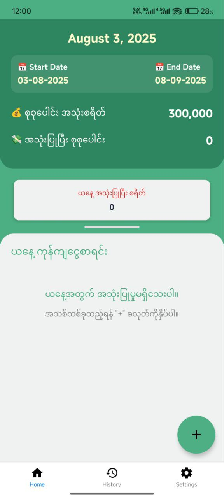

## 💰 Moh – Smart Expense Tracker

### An expense tracking app built to help you record, manage, and control your daily spending with ease.

### ✨ Features
#### - 🎯 Set Budgets: Define your budget with flexible start and end dates  
#### - 🚦 Spending Limits: Stay in control with limits  
#### - 📳 Get a vibration alert each time an expense is added, if the total spending limit is exceeded.  
#### - 🤖 Telegram Bot Integration: Get insights and suggestions via chat  
#### - 📆 Daily Tracking: Log expenses on the go  
#### - 📊 Expense History: Filter by date, category

## 📸 App
### 

## 🚀 Getting Started

### 📦 Installation
git clone https://github.com/htetzawphyo/Moh.git

`cd moh`  
`npm install`  
`npx drizzle-kit generate`  

### ▶️ Run in Development
#### Make sure you have the Expo Go app installed on your phone
`npx expo start`  

#### Scan the QR code in Expo DevTools using your phone

### 📱 Build Production App (EAS)
#### Configure EAS
`eas build:configure`  

### Build for Android
`eas build --platform android`  

### Or build for iOS
`eas build --platform ios`  

### ℹ️ For full setup instructions, visit: https://docs.expo.dev/build/introduction/

### 🛠 Tech Stack
#### - ⚛️ React Native
#### - 🚀 Expo
#### - 🧠 Zustand (state management)
#### - 💾 SQLite (local storage)
#### - 🧬 Drizzle ORM (database abstraction)
